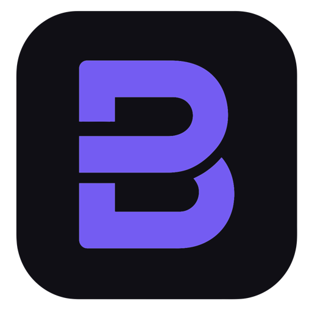

<p align="center">
  
</p>

<h1 align="center">Budżet</h1>

<p align="center">
  Osobisty budżet kopertowy - PWA do kontroli wydatków i oszczędzania.
  <br />
  <a href="https://budzet-rust.vercel.app"><strong>🔗 budzet-rust.vercel.app</strong></a>
</p>

<p align="center">
  
  
  
  
  
  
  
</p>

---

## O aplikacji

**Budżet** to aplikacja webowa (PWA) do zarządzania budżetem osobistym, inspirowana [systemem budżetowania kopertowego](https://pl.wikipedia.org/wiki/Metoda_kopertowa). Odpowiada na cztery pytania natychmiast po otwarciu:

1. 💰 **Ile mam wolnych środków** do najbliższej wypłaty?
2. 📊 **Ile mogę dziś wydać**, żeby wyjść na swoje?
3. 💎 **Ile mam odłożone** i na co konkretnie?
4. ⚡ **Ile w tym miesiącu** poszło na impulsy?

Wszystko wpisywane ręcznie, w czasie rzeczywistym - bez integracji z bankiem, bo to jest celowe. Świadome wpisywanie wydatku w sklepie zmienia nawyki skuteczniej niż automatyczny import.

## Funkcje

### Pulpit
- **Główny wskaźnik** - wolne środki + dzienny limit wydatków
- **Zobowiązania stałe** - checklist miesięcznych rachunków z oznaczaniem jako opłacone
- **Wydatki jednorazowe** - szybkie dodawanie z 15 kategoriami i auto-detekcją
- **Koperty oszczędnościowe** - wizualne kafelki z poziomem napełnienia

### Zarządzanie finansami
- **System okresów** - od wypłaty do wypłaty (nie miesiąc kalendarzowy)
- **Rozdysponowanie środków** - proporcjonalny podział reszty na koperty
- **Termin końca spłaty** - opcjonalny end date dla kredytów i rat
- **Impulsy** - oznaczanie wydatków impulsywnych i śledzenie ich sumy

### Statystyki
- **Podsumowanie okresu** - przychód, wydatki, stopa oszczędności
- **Kategorie** - ranking wydatków z wykresem słupkowym
- **Trendy** - porównanie między okresami (wykresy Recharts)
- **Plan vs. rzeczywistość** - wydatki stałe: planowane vs. zapłacone

### Bezpieczeństwo
- **Szyfrowanie E2E** - AES-256-GCM z kluczem PBKDF2 z hasla uzytkownika. Kwoty, nazwy, notatki szyfrowane po stronie klienta - nawet administrator bazy nie odczyta danych
- **Walidacja wejscia** - sanitizacja HTML/XSS, walidacja email (RFC 5322), walidacja hasla (8+ znakow, litera + cyfra), limity dlugosci na wszystkich polach
- **Rate limiting** - ograniczenie prob rejestracji (3/min + cooldown) + Firebase server-side
- **PIN lock** - blokada aplikacji (4-cyfrowy PIN, klawiatura fizyczna + ekranowa)
- **Zmiana hasla** - z automatyczna re-enkrypcja wszystkich danych

### Wygoda
- **Offline mode** - Firestore persistent cache + Service Worker
- **Instalacja PWA** - pelny ekran na telefonie, skroty do dodawania wydatkow
- **iOS safe areas** - poprawna obsluga notcha i dynamicznej wyspy
- **Eksport danych** - CSV (transakcje) i JSON (pelna kopia zapasowa)

## Stack technologiczny

| Warstwa | Technologia |
|---|---|
| Framework | Next.js 15 (App Router) |
| UI | React 19, Tailwind CSS v4 |
| Język | TypeScript (strict, zero `any`) |
| Baza danych | Cloud Firestore (offline persistence) |
| Autoryzacja | Firebase Auth (email + hasło) |
| Stan klienta | Zustand |
| Wykresy | Recharts |
| Walidacja | Zod + custom validators |
| Testy | Vitest (110 testów) |
| PWA | Serwist (Service Worker) |
| Deploy | Vercel (auto-deploy z GitHub) |
| Szyfrowanie | Web Crypto API (AES-256-GCM, PBKDF2) |
| Czcionki | Fraunces (kwoty), Inter Tight (UI), Geist Mono (tabele) |

## Architektura

```
src/
├── app/                  # Next.js App Router - strony i layout
│   ├── layout.tsx        # root layout, fonty, metadata
│   ├── page.tsx          # landing page (publiczna strona glowna)
│   ├── (main)/           # grupa autentykowanych stron
│   │   ├── dashboard/    # pulpit
│   │   ├── expenses/     # lista wydatków z filtrami
│   │   ├── envelopes/    # widok kopert
│   │   └── stats/        # statystyki (zakładki)
│   ├── (auth)/           # logowanie, rejestracja, reset hasla
│   ├── settings/         # ustawienia konta
│   └── onboarding/       # kreator pierwszej konfiguracji
│
├── domain/               # Czysta logika finansowa (zero Reacta)
│   ├── types.ts          # typy domenowe (Period, Transaction, Envelope…)
│   ├── schemas.ts        # schematy Zod do walidacji danych z Firestore
│   ├── money.ts          # formatPLN, parsePLN, terminalInputToGrosze
│   ├── calculations.ts   # salda, wolne środki, dzienny limit
│   ├── operations.ts     # closePeriod, distributeFunds
│   ├── statistics.ts     # podsumowania, trendy, kategorie
│   ├── constants.ts      # 15 kategorii wydatków z auto-detekcją
│   ├── export.ts         # eksport CSV/JSON, import kopii zapasowej
│   └── defaults.ts       # domyślne wydatki stałe i koperty
│
├── components/           # komponenty React
│   ├── dashboard/        # sekcje pulpitu
│   ├── stats/            # zakładki statystyk
│   ├── views/            # widoki stron (DashboardView, StatsView…)
│   └── ui/               # bazowe komponenty UI (Button, Sheet…)
│
└── lib/                  # infrastruktura
    ├── firebase/         # config, auth, db (Firestore CRUD z enkrypcja)
    ├── crypto/           # E2E: AES-256-GCM encrypt/decrypt, PBKDF2
    ├── validation.ts     # sanitizacja XSS, walidacja email/hasla/kwot
    ├── contexts/         # sheet-context (globalne bottom sheets)
    └── hooks/            # use-auth, use-budget-data
```

### Kluczowe decyzje projektowe

- **Kwoty w groszach** - wszystkie kwoty to `number` w groszach (integer). `990 zł` → `99000`. Formatowanie wyłącznie przez `formatPLN()`. Zero operacji na floatach.
- **Salda obliczane, nie zapisywane** - saldo koperty = suma transakcji. Nigdy nie jest polem w bazie.
- **Logika bez Reacta** - `src/domain/` to czyste funkcje z typami. Testowalne bez renderowania.
- **Optymistyczny UI** - zmiana widoczna natychmiast, zapis w tle dzięki Firestore offline persistence.
- **E2E encryption** - kwoty, nazwy i notatki szyfrowane AES-256-GCM. Klucz wyprowadzany z hasla uzytkownika (PBKDF2, 100k iteracji). Zero zewnetrznych zaleznosci - tylko Web Crypto API.
- **Input sanitization** - wszystkie dane uzytkownika przechodza przez sanitize() przed zapisem. Walidacja email blokuje HTML/script injection.
- **Dark-only** - paleta "cichy panel kontrolny": ciemna z akcentem purple (#7C5CFC).

## Uruchomienie lokalne

### Wymagania

- Node.js 20+
- Projekt Firebase z Firestore i Authentication (email/password)

### Instalacja

```bash
git clone https://github.com/w84kubus/budzet.git
cd budzet
npm install
```

### Konfiguracja

Utwórz plik `.env.local`:

```env
NEXT_PUBLIC_FIREBASE_API_KEY=your_api_key
NEXT_PUBLIC_FIREBASE_AUTH_DOMAIN=your_project.firebaseapp.com
NEXT_PUBLIC_FIREBASE_PROJECT_ID=your_project_id
NEXT_PUBLIC_FIREBASE_STORAGE_BUCKET=your_project.firebasestorage.app
NEXT_PUBLIC_FIREBASE_MESSAGING_SENDER_ID=your_sender_id
NEXT_PUBLIC_FIREBASE_APP_ID=your_app_id
```

### Komendy

```bash
npm run dev        # serwer deweloperski (localhost:3000)
npm run build      # produkcyjny build
npm run typecheck  # tsc --noEmit
npm run lint       # next lint
npm run test       # vitest run (110 testów)
npm run test:watch # vitest w trybie watch
```

## Instalacja na telefonie (PWA)

Aplikacja jest w pełni instalowalna jako PWA:

| Platforma | Instrukcja |
|---|---|
| **iOS** | Safari → Udostępnij (↑) → *Dodaj do ekranu początkowego* |
| **Android** | Chrome → Menu (⋮) → *Zainstaluj aplikację* |

Po instalacji działa w pełnym ekranie, ma własną ikonę i działa offline.

## Licencja

Projekt prywatny. Kod źródłowy dostępny publicznie w celach edukacyjnych.
